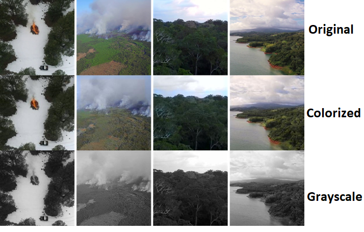

# Gradual_Learning_Colorization
Real-time colorization of drone images
## What is this project about?
Reducing the amount of sent data by the drone. This happens by sending less information of each image: one channel (Y channel in YUV space) instead of three channels. Then colorizing the received image in our server.
To this end, a colored image will be send with each N grayscale image as a reference to colorize the grayscale images. Our model will be updated during the process by each colored image.

